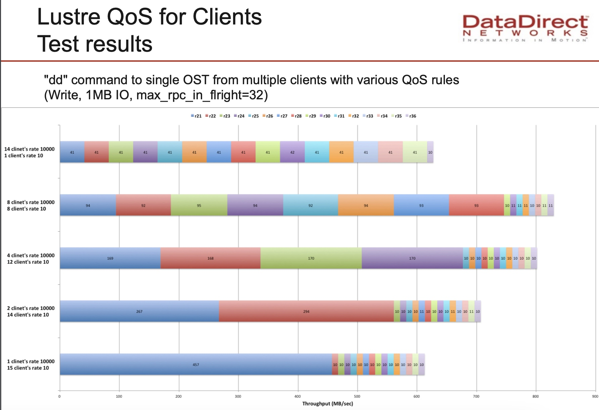

# QOS配置说明

## 前言
lustre的qos跟我们之前使用的文件系统的qos存在一定的区别，之前的qos通过设置iops或者带宽来达到精准的qos的设置，而lustre的设置是进行的相对的设置，也就是并不是直接设置到精准的io，是通过设置的rpc请求数，然后内部根据总的资源情况来进行资源的平衡

这个设置在大量的客户端使用的时候比较有用，官方的例子里面也是在很多客户端的时候，可以看出来效果

## 官方的例子
>https://www.eofs.eu/_media/events/lad13/18_shuichi_ihara_lad13-tbf-rev2.pdf



可以看到官方采用了16个客户端，并且同时进行dd的测试，然后设置不同的qos，qos设置两种，一种是10000的rate，一种是10的rate，这里有个max_rpc_inflight=32

```bash
[root@lab102 ~]# lctl get_param osc.*.max_rpcs_in_flight
osc.lustrefs-OST0000-osc-MDT0000.max_rpcs_in_flight=8
osc.lustrefs-OST0000-osc-ffff9552e4e09000.max_rpcs_in_flight=8
osc.lustrefs-OST0001-osc-MDT0000.max_rpcs_in_flight=8
osc.lustrefs-OST0001-osc-ffff9552e4e09000.max_rpcs_in_flight=8
osc.lustrefs-OST0002-osc-MDT0000.max_rpcs_in_flight=8
osc.lustrefs-OST0002-osc-ffff9552e4e09000.max_rpcs_in_flight=8
osc.lustrefs-OST0003-osc-MDT0000.max_rpcs_in_flight=8
osc.lustrefs-OST0003-osc-ffff9552e4e09000.max_rpcs_in_flight=8
osc.lustrefs-OST0004-osc-MDT0000.max_rpcs_in_flight=8
osc.lustrefs-OST0004-osc-ffff9552e4e09000.max_rpcs_in_flight=8
osc.lustrefs-OST0005-osc-MDT0000.max_rpcs_in_flight=8
osc.lustrefs-OST0005-osc-ffff9552e4e09000.max_rpcs_in_flight=8
osc.lustrefs-OST0006-osc-MDT0000.max_rpcs_in_flight=8
osc.lustrefs-OST0006-osc-ffff9552e4e09000.max_rpcs_in_flight=8
osc.lustrefs-OST0007-osc-MDT0000.max_rpcs_in_flight=8
osc.lustrefs-OST0007-osc-ffff9552e4e09000.max_rpcs_in_flight=8
```
这个参数默认是8，调整后，可以增加单个客户端的性能
```bash
[root@lab102 ~]# lctl set_param osc.*.max_rpcs_in_flight=32
```
## QOS测试
我们进行qos的设置
```bash
lctl set_param ost.OSS.ost_io.nrs_policies="tbf nid"
lctl set_param ost.OSS.ost_io.nrs_tbf_rule="start fast nid={192.168.19.[201-202]@tcp} rate=10000"
lctl set_param ost.OSS.ost_io.nrs_tbf_rule="start slow nid={192.168.19.[203-210]@tcp} rate=10"
```
tbf也支持其它的，通过nid进行设置的比较简单一些，也比较通用，如果有碰到特殊的用户再根据客户需求定制，一般这个就可以满足了

查看规则
```bash
[root@lab102 ~]# lctl get_param  ost.OSS.ost_io.nrs_tbf_rule
ost.OSS.ost_io.nrs_tbf_rule=
regular_requests:
CPT 0:
slow {192.168.19.[203-210]@tcp} 10, ref 0
fast {192.168.19.[201-202]@tcp} 10000, ref 0
default {*} 10000, ref 0
CPT 1:
slow {192.168.19.[203-210]@tcp} 10, ref 0
fast {192.168.19.[201-202]@tcp} 10000, ref 0
default {*} 10000, ref 0
high_priority_requests:
CPT 0:
slow {192.168.19.[203-210]@tcp} 10, ref 0
fast {192.168.19.[201-202]@tcp} 10000, ref 0
default {*} 10000, ref 0
CPT 1:
slow {192.168.19.[203-210]@tcp} 10, ref 0
fast {192.168.19.[201-202]@tcp} 10000, ref 0
default {*} 10000, ref 0
```

设置前两个客户端为10000，其它客户端为10，然后同时dd看下
```bash
[root@host1 host1]# dd if=/dev/zero of=a bs=4M count=1000
1000+0 records in
1000+0 records out
4194304000 bytes (4.2 GB) copied, 121.641 s, 34.5 MB/s

[root@host2 host2]# dd if=/dev/zero of=a bs=4M count=1000
1000+0 records in
1000+0 records out
4194304000 bytes (4.2 GB) copied, 114.571 s, 36.6 MB/s
```

其它
```bash
[root@host5 host5]# dd if=/dev/zero of=a bs=4M count=1000
1000+0 records in
1000+0 records out
4194304000 bytes (4.2 GB) copied, 188.248 s, 22.3 MB/s
```
其它的可以看到性能确实比我们设置高的那个要低一些

## 规则删除
```bash
[root@lab102 ~]# lctl set_param ost.OSS.ost_io.nrs_tbf_rule="stop fast"
ost.OSS.ost_io.nrs_tbf_rule=stop fast
[root@lab102 ~]# lctl set_param ost.OSS.ost_io.nrs_tbf_rule="stop slow"
ost.OSS.ost_io.nrs_tbf_rule=stop slow
```

设置201 202 slow 设置其它的fast，看下效果

可以看到201 202确实慢些，26左右，其它的34左右

所以这个qos在资源混用很多的情况下，某些客户端需要给高的实用优先级的时候，能够起到一定的左右


lctl get_param  ost.OSS.ost_io.nrs_tbf_rule
看下参数是不是重启失效
重启失效了，参数怎么固化

## 参数固化
```bash
lctl set_param -P xxxx
```
通过加入参数-P来进行固化，这个在mgs的机器上面操作，因为上面的规则的删除也是通过运行set_param stop操作的，所以删除也是通过这个参数来处理，如果不固化，重启后参数的设置就失效了

开启qos开启的是tbf nid
如果要完全关闭
```bash
lctl set_param -P ost.OSS.ost_io.nrs_policies="fifo"
```
就设置为默认的fifo即可


## 平台设置建议
就按lustre本身提供的规则进行处理
规则名称 规则范围（单个ip，还是一串ip） 设置rate（自己填，默认10000)（需要慢的就填10）


